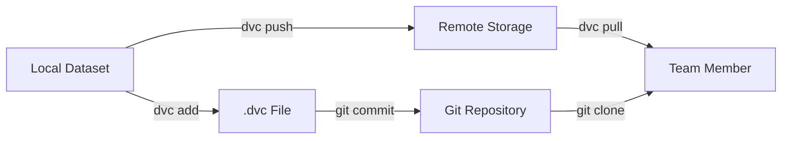

## Overview

Data Version Control (DVC) extends Git's capabilities to handle large datasets, models, and ML artifacts. The AI Data Science Service uses DVC to ensure reproducible experiments, efficient data sharing, and complete lineage tracking.

<Note>
  **Core Principle**: "You can't reproduce an ML experiment without versioning the data."
  
  DVC makes datasets as version-controlled as code, enabling true reproducibility.
</Note>

## Why DVC?

### The Problem with Git Alone

Git excels at tracking code but struggles with large files:

<CardGroup cols={2}>
  <Card title="Git Limitations" icon="triangle-exclamation">
    - Large files bloat repository size
    - Slow clone and fetch operations
    - GitHub file size limits (100MB)
    - Expensive storage costs
  </Card>
  
  <Card title="DVC Solutions" icon="circle-check">
    - Lightweight `.dvc` pointers in Git
    - Data stored in cloud (S3, Azure, GCS)
    - Fast operations with selective sync
    - Unlimited dataset sizes
  </Card>
</CardGroup>

### DVC Benefits

<AccordionGroup>
  <Accordion title="Reproducibility" icon="repeat">
    Every experiment can be exactly reproduced with the correct data version:
    
    ```bash
    # Checkout specific experiment
    git checkout experiment-branch
    
    # Pull exact data version
    dvc pull
    
    # Reproduce results
    python training/training.py --config config.yaml
    ```
    
    **Guarantees:**
    - Same code + same data = same results
    - Complete experiment lineage
    - Audit trail for compliance
  </Accordion>
  
  <Accordion title="Collaboration" icon="users">
    Team members efficiently share datasets without repository bloat:
    
    ```bash
    # Team member A adds new dataset
    dvc add datasets/new_data.csv
    git add datasets/new_data.csv.dvc
    git commit -m "Add new training data"
    dvc push
    git push
    
    # Team member B downloads only what they need
    git pull
    dvc pull datasets/new_data.csv.dvc
    ```
    
    **Advantages:**
    - Selective data downloads
    - Parallel workflows
    - No data duplication
  </Accordion>
  
  <Accordion title="Efficient Storage" icon="hard-drive">
    DVC deduplicates data and uses remote storage:
    
    ```
    Repository Size Comparison:
    
    Without DVC:
    ├── Git repo: 10GB (code + data)
    └── Clone time: 20 minutes
    
    With DVC:
    ├── Git repo: 50MB (code + .dvc files)
    ├── Remote storage: 10GB (S3/DagsHub)
    └── Clone time: 30 seconds + selective data pull
    ```
    
    **Cost Savings:**
    - S3 storage: ~$0.023/GB/month
    - GitHub LFS: ~$5/50GB/month
    - DagsHub: Free tier available
  </Accordion>
  
  <Accordion title="Version Tracking" icon="code-branch">
    Track data evolution alongside code:
    
    ```bash
    # View data version history
    git log -- datasets/credit_data.csv.dvc
    
    # Compare data between branches
    git diff main experiment -- datasets/credit_data.csv.dvc
    
    # Rollback data to previous version
    git checkout HEAD~1 -- datasets/credit_data.csv.dvc
    dvc checkout
    ```
  </Accordion>
</AccordionGroup>

## DVC Architecture

### How DVC Works



<Info>
  **Key Concept**: `.dvc` files are small text files (~100 bytes) containing checksums and metadata. They're committed to Git, while actual data lives in remote storage.
</Info>

### DVC File Anatomy

```yaml german_credit_risk_v1.0.0_training_23012026.csv.dvc
outs:
- md5: 3086216ff1ff32f7626554e730cccc91
  size: 53393
  hash: md5
  path: german_credit_risk_v1.0.0_training_23012026.csv
```

**Components:**
- **md5**: Content hash for integrity verification
- **size**: File size in bytes
- **hash**: Hashing algorithm used
- **path**: Local file path reference

## Project Implementation

### Dataset Structure

```
datasets/
└── credit_score_dataset/
    ├── german_credit_risk_v1.0.0_training_23012026.csv      # Actual data (not in Git)
    └── german_credit_risk_v1.0.0_training_23012026.csv.dvc  # DVC pointer (in Git)
```

### DVC Configuration

```python .dvcignore
# Add patterns of files dvc should ignore
# Improves performance by excluding unnecessary files

*.pyc
__pycache__/
.git/
.env
mlruns/
*.log
```

### Remote Storage Setup

DVC supports multiple storage backends:

<Tabs>
  <Tab title="S3 (AWS)">
    ```bash
    # Configure S3 remote
    dvc remote add -d storage s3://my-bucket/dvc-store
    dvc remote modify storage region us-west-2
    
    # Set credentials (use AWS IAM roles in production)
    dvc remote modify storage access_key_id YOUR_ACCESS_KEY
    dvc remote modify storage secret_access_key YOUR_SECRET_KEY
    ```
    
    **Best Practices:**
    - Use IAM roles instead of access keys
    - Enable server-side encryption
    - Configure lifecycle policies for cost optimization
  </Tab>
  
  <Tab title="Azure Blob">
    ```bash
    # Configure Azure Blob Storage
    dvc remote add -d storage azure://mycontainer/dvc-store
    dvc remote modify storage account_name mystorageaccount
    
    # Set connection string
    dvc remote modify storage connection_string "DefaultEndpointsProtocol=https;..."
    ```
    
    **Configuration:**
    - Supports SAS tokens
    - Integrated with Azure AD
    - Geo-redundant storage options
  </Tab>
  
  <Tab title="DagsHub">
    ```bash
    # Configure DagsHub (Git + DVC + MLflow)
    dvc remote add -d origin https://dagshub.com/user/repo.dvc
    dvc remote modify origin --local auth basic
    dvc remote modify origin --local user YOUR_USERNAME
    dvc remote modify origin --local password YOUR_TOKEN
    ```
    
    **Advantages:**
    - Free tier available
    - Integrated with MLflow
    - Web UI for data exploration
    - Built-in collaboration features
  </Tab>
  
  <Tab title="Google Cloud">
    ```bash
    # Configure Google Cloud Storage
    dvc remote add -d storage gs://my-bucket/dvc-store
    dvc remote modify storage projectname my-project
    
    # Authenticate
    gcloud auth application-default login
    ```
    
    **Features:**
    - Multi-regional storage
    - Nearline/Coldline for archival
    - Integrated with GCP IAM
  </Tab>
</Tabs>

## Common Workflows

### Adding New Datasets

```bash
# 1. Add dataset to DVC tracking
dvc add datasets/credit_score_dataset/new_training_data.csv

# 2. Commit the .dvc file to Git
git add datasets/credit_score_dataset/new_training_data.csv.dvc
git add datasets/credit_score_dataset/.gitignore  # Auto-generated
git commit -m "Add new training dataset v2.0.0"

# 3. Push data to remote storage
dvc push

# 4. Push code changes to Git
git push
```

<Note>
  DVC automatically updates `.gitignore` to exclude the actual data file, preventing accidental Git commits.
</Note>

### Retrieving Data

```bash
# Clone repository (gets code + .dvc files)
git clone https://github.com/org/project.git
cd project

# Pull all tracked data
dvc pull

# Or pull specific files
dvc pull datasets/credit_score_dataset/german_credit_risk_v1.0.0_training_23012026.csv.dvc
```

### Updating Datasets

```bash
# Modify the dataset
python scripts/update_data.py

# Update DVC tracking
dvc add datasets/credit_score_dataset/german_credit_risk_v1.0.0_training_23012026.csv

# Commit changes
git add datasets/credit_score_dataset/german_credit_risk_v1.0.0_training_23012026.csv.dvc
git commit -m "Update training data: added 1000 new samples"

# Push updated data
dvc push
git push
```

### Switching Data Versions

```bash
# Checkout previous data version
git checkout v1.0 -- datasets/credit_score_dataset/german_credit_risk_v1.0.0_training_23012026.csv.dvc

# Sync data to match .dvc file
dvc checkout

# Verify data version
dvc status
```

## Integration with Training

### Reproducible Training Pipeline

```python training/training.py
import os
import logging

logger = logging.getLogger(__name__)

def train(args):
    # Reference specific dataset version
    dataset_path = os.path.join(
        os.path.dirname(__file__),
        "..",
        "..",
        "..",
        "datasets",
        "credit_score_dataset",
        "german_credit_risk_v1.0.0_training_23012026.csv"  # Versioned filename
    )
    dataset_path = os.path.abspath(dataset_path)
    
    # Verify data exists
    if not os.path.exists(dataset_path):
        logger.error(f"Dataset not found at {dataset_path}")
        logger.info("Run 'dvc pull' to download dataset")
        raise FileNotFoundError(f"Dataset missing: {dataset_path}")
    
    logger.info(f"Loading data from {dataset_path}")
    df = load_data(dataset_path)
    
    # Log dataset metadata to MLflow
    import mlflow
    mlflow.log_param("dataset_path", dataset_path)
    mlflow.log_param("dataset_size", len(df))
    mlflow.log_param("dataset_md5", get_file_md5(dataset_path))
    
    # Continue training...
```

**Best Practices:**
- Include dataset version in filename
- Log dataset metadata to MLflow
- Fail fast if data is missing
- Document data requirements in README

### Version Naming Convention

```
<dataset_name>_v<major>.<minor>.<patch>_<purpose>_<date>.csv

Examples:
german_credit_risk_v1.0.0_training_23012026.csv
german_credit_risk_v1.1.0_validation_15022026.csv
german_credit_risk_v2.0.0_training_01032026.csv

Version Semantics:
- Major: Breaking schema changes
- Minor: Backward-compatible additions
- Patch: Bug fixes, data corrections
```

## Advanced Patterns

### DVC Pipelines

Define reproducible data processing workflows:

```yaml dvc.yaml
stages:
  preprocess:
    cmd: python scripts/preprocess.py
    deps:
      - scripts/preprocess.py
      - datasets/raw/german_credit_risk_raw.csv
    outs:
      - datasets/processed/german_credit_risk_v1.0.0_training_23012026.csv
    params:
      - preprocess.remove_outliers
      - preprocess.handle_missing
  
  train:
    cmd: python training/training.py --config config/model_config_001.yaml
    deps:
      - training/training.py
      - datasets/processed/german_credit_risk_v1.0.0_training_23012026.csv
      - config/models-configs/model_config_001.yaml
    outs:
      - model/model_weights_001.pth
    metrics:
      - mlruns/metrics.json
```

**Run Pipeline:**
```bash
# Execute entire pipeline
dvc repro

# Run specific stage
dvc repro train

# Visualize pipeline
dvc dag
```

### Data Registry

Centralize datasets across projects:

```bash
# Create data registry repository
git init data-registry
cd data-registry

# Add datasets
dvc add datasets/credit_score/german_credit_risk_v1.0.0.csv
dvc add datasets/energy_imports/energy_data_v1.0.0.csv
git add .
git commit -m "Initialize data registry"
dvc push

# Import data in projects
cd /path/to/ml-project
dvc import https://github.com/org/data-registry datasets/credit_score/german_credit_risk_v1.0.0.csv
```

### Experiment Tracking Integration

Combine DVC with MLflow for complete lineage:

```python
import mlflow
import dvc.api

# Get dataset metadata from DVC
with dvc.api.open(
    'datasets/credit_score_dataset/german_credit_risk_v1.0.0_training_23012026.csv',
    mode='r'
) as f:
    df = pd.read_csv(f)

# Log to MLflow
with mlflow.start_run():
    mlflow.log_param("dataset_url", dvc.api.get_url(
        'datasets/credit_score_dataset/german_credit_risk_v1.0.0_training_23012026.csv'
    ))
    mlflow.log_param("dvc_version", dvc.__version__)
    mlflow.log_param("git_commit", get_git_commit())
```

## Best Practices

<CardGroup cols={2}>
  <Card title="Version Everything" icon="code-branch">
    - Track all datasets, models, and artifacts
    - Include version in filenames
    - Document data lineage
    - Tag releases in Git
  </Card>
  
  <Card title="Selective Sync" icon="filter">
    - Pull only required datasets
    - Use `.dvcignore` for temporary files
    - Organize datasets by project
    - Clean unused cache regularly
  </Card>
  
  <Card title="Remote Storage" icon="cloud">
    - Never commit large files to Git
    - Use appropriate storage tier (hot/cold)
    - Enable encryption at rest
    - Configure backup policies
  </Card>
  
  <Card title="Access Control" icon="lock">
    - Use IAM roles instead of keys
    - Separate dev/prod remotes
    - Audit data access logs
    - Rotate credentials regularly
  </Card>
</CardGroup>

## Troubleshooting

<AccordionGroup>
  <Accordion title="Data Not Found" icon="triangle-exclamation">
    **Symptom:**
    ```
    FileNotFoundError: Dataset not found at datasets/credit_score_dataset/german_credit_risk_v1.0.0_training_23012026.csv
    ```
    
    **Solution:**
    ```bash
    # Check DVC status
    dvc status
    
    # Pull missing data
    dvc pull
    
    # Verify data integrity
    dvc checkout
    ```
  </Accordion>
  
  <Accordion title="DVC Push Fails" icon="circle-exclamation">
    **Symptom:**
    ```
    ERROR: failed to push data to remote - access denied
    ```
    
    **Solutions:**
    ```bash
    # Check remote configuration
    dvc remote list
    dvc remote list --local
    
    # Verify credentials
    dvc remote modify storage --local access_key_id YOUR_KEY
    
    # Test connection
    dvc pull --remote storage
    ```
  </Accordion>
  
  <Accordion title="Cache Management" icon="hard-drive">
    **Check cache size:**
    ```bash
    # View cache location
    dvc cache dir
    
    # Check cache size
    du -sh .dvc/cache
    ```
    
    **Clean unused cache:**
    ```bash
    # Remove unreferenced cache
    dvc gc --workspace
    
    # Remove all cache (use with caution)
    dvc gc --all-branches --all-tags --all-commits
    ```
  </Accordion>
  
  <Accordion title="Merge Conflicts" icon="code-merge">
    **When `.dvc` files conflict:**
    ```bash
    # Accept one version
    git checkout --ours datasets/data.csv.dvc
    # or
    git checkout --theirs datasets/data.csv.dvc
    
    # Sync data
    dvc checkout
    
    # Complete merge
    git add datasets/data.csv.dvc
    git commit
    ```
  </Accordion>
</AccordionGroup>

## Quick Reference

```bash
# Initialize DVC in repository
dvc init

# Add dataset to tracking
dvc add datasets/data.csv

# Configure remote storage
dvc remote add -d myremote s3://bucket/path

# Push data to remote
dvc push

# Pull data from remote
dvc pull

# Pull specific files
dvc pull datasets/data.csv.dvc

# Check status
dvc status

# Update tracked file
dvc add datasets/data.csv

# Switch to specific version
git checkout <commit> -- datasets/data.csv.dvc
dvc checkout

# Remove from tracking
dvc remove datasets/data.csv.dvc

# View data URL without pulling
dvc get-url datasets/data.csv

# Import from another repository
dvc import <repo_url> datasets/data.csv
```

## Next Steps

<CardGroup cols={2}>
  <Card title="MLOps Architecture" icon="diagram-project" href="/concepts/mlops-architecture">
    Integrate DVC with MLflow for complete lineage
  </Card>
  <Card title="Project Structure" icon="folder-tree" href="/concepts/project-structure">
    Understand where data fits in the project
  </Card>
</CardGroup>