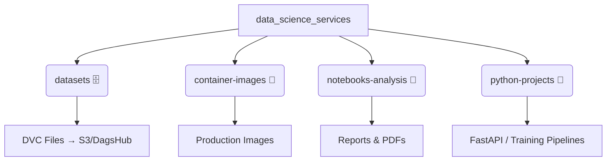

## Overview

The AI Data Science Service follows a modular architecture that separates concerns across data, research, infrastructure, and production code. This structure enables teams to work independently while maintaining integration points for the complete ML lifecycle.

<Info>
  **Design Philosophy**: Extreme modularity where business logic, training, and inference live in separate, decoupled layers.
</Info>

## Repository Architecture

### High-Level Structure

The repository is organized into four main domains:



<CardGroup cols={2}>
  <Card title="datasets/" icon="database">
    Version-controlled data indexes with DVC
  </Card>
  <Card title="container-images/" icon="docker">
    Production-ready Docker configurations
  </Card>
  <Card title="notebooks-analysis/" icon="microscope">
    Exploratory data analysis and research
  </Card>
  <Card title="python-projects/" icon="code">
    Production-grade applications and services
  </Card>
</CardGroup>

## Directory Breakdown

### 1. datasets/ - Data Management

**"The Source of Truth"**

This directory acts as an intelligent index for datasets, not a storage location for raw data files.

```
datasets/
└── credit_score_dataset/
    └── german_credit_risk_v1.0.0_training_23012026.csv.dvc
```

**Key Features:**
- **DVC Integration**: Stores `.dvc` metadata files that point to remote storage
- **Version Control**: Tracks exact dataset versions used in experiments
- **Efficient Downloads**: Team members pull only required data versions
- **Remote Storage**: Actual data stored in S3, DagsHub, or Azure Blob

<Note>
  DVC files are small text files (~100 bytes) containing checksums and references. The actual datasets remain in cloud storage, keeping the Git repository lightweight.
</Note>

### 2. container-images/ - Infrastructure

**"Ready for Liftoff"**

Contains immutable infrastructure definitions for production deployments.

**Contents:**
- Base Dockerfiles for different environments
- Optimized production configurations
- Multi-stage build definitions
- Security hardening configurations

**Benefits:**
- "Works on my machine" → "Works in production"
- Consistent environments across development and deployment
- Reproducible builds with version pinning

### 3. notebooks-analysis/ - Research Lab

**"The Laboratory of Ideas"**

Space for creativity, exploration, and statistical analysis.

**Contents:**
- Jupyter notebooks for Exploratory Data Analysis (EDA)
- Rapid prototyping experiments
- PDF exports for stakeholder communication
- Visualization and insight generation

**Best Practices:**
- Keep notebooks focused on exploration
- Export production code to `python-projects/`
- Version control notebooks with outputs cleared
- Generate PDF reports for non-technical stakeholders

### 4. python-projects/ - Production Engine

**"Where Code Becomes Professional"**

Structured applications following software engineering best practices.

## Credit Score Project Structure

### Complete Directory Tree

```
credit-score/
├── .venv/                          # Virtual environment (UV managed)
├── .python-version                 # Python version pinning (3.10+)
├── config/                         # ⚙️ Centralized Configuration
│   ├── logs_configs/
│   │   ├── __init__.py
│   │   ├── logging_config.py       # Logging setup and handlers
│   │   └── logging_config.yaml     # Logging configuration
│   └── models-configs/             # Model hyperparameters
│       ├── model_config_000.yaml   # Baseline configuration
│       ├── model_config_001.yaml   # Production configuration
│       └── model_config_002.yaml   # Experimental variants
├── examples/                       # 🎮 Demonstrations and Clients
│   └── client_web/
│       ├── main.py                 # Streamlit/Gradio web interface
│       └── static/                 # Frontend assets
├── inference/                      # 🧠 Inference Engine
│   ├── __init__.py
│   └── inference.py                # Predictor singleton class
├── mlruns/                         # 📊 MLflow Tracking Store
│   └── <experiment_id>/
│       └── <run_id>/
│           ├── artifacts/          # Model weights, plots
│           ├── metrics/            # Training metrics
│           └── params/             # Hyperparameters
├── model/                          # 📐 Neural Network Architecture
│   ├── __init__.py
│   ├── model.py                    # PyTorch nn.Module definition
│   ├── model_weights_000.pth       # Trained model checkpoints
│   ├── model_weights_001.pth
│   └── model_weights_002.pth
├── processing/                     # 🧹 Data Engineering
│   ├── __init__.py
│   ├── preprocessor.py             # Feature engineering pipeline
│   └── preprocessor.joblib         # Fitted sklearn pipeline
├── server/                         # 🚀 API Gateway
│   ├── __init__.py
│   ├── api.py                      # FastAPI application
│   └── schemas.py                  # Pydantic data models
├── training/                       # 🏋️ Training Pipeline
│   ├── __init__.py
│   └── training.py                 # Training orchestration
├── .dockerignore                   # Docker build exclusions
├── .gitignore                      # Git exclusions
├── Dockerfile.api                  # API container definition
├── Dockerfile.client               # Client container definition
├── docker-compose.yml              # Multi-service orchestration
├── pyproject.toml                  # Modern Python project config
├── requirements.txt                # Production dependencies
├── dev_requirements.txt            # Development dependencies
├── uv.lock                         # Dependency version lock
└── README.md                       # Project documentation
```

## Module Responsibilities

<AccordionGroup>
  <Accordion title="config/ - Configuration Management" icon="gear">
    Centralizes all configuration files for reproducibility and easy experimentation.
    
    **logs_configs/**
    ```python logging_config.py
    import logging.config
    import yaml
    
    def setup_logging():
        """Configure logging from YAML file."""
        with open('config/logs_configs/logging_config.yaml', 'r') as f:
            config = yaml.safe_load(f)
        logging.config.dictConfig(config)
    ```
    
    **models-configs/**
    - Hyperparameter versioning
    - A/B testing configurations
    - Production vs. experimental settings
    
    <Info>
      Configuration files enable changing model behavior without code changes, crucial for MLOps workflows.
    </Info>
  </Accordion>
  
  <Accordion title="model/ - Neural Network Architecture" icon="brain">
    Defines the PyTorch model architecture and configuration classes.
    
    ```python model/model.py
    import torch.nn as nn
    from dataclasses import dataclass
    
    @dataclass
    class ModelConfig:
        input_size: int
        output_size: int
        hidden_layers: list[int]
        activation_functions: list[str]
        dropout_rate: float
        learning_rate: float
        epochs: int
        batch_size: int
    
    class CreditScoreModel(nn.Module):
        def __init__(self, config: ModelConfig):
            super().__init__()
            # Dynamic layer construction based on config
            self.layers = self._build_layers(config)
        
        def forward(self, x):
            return self.layers(x)
    ```
    
    **Features:**
    - Dynamic architecture from configuration
    - Configurable activation functions
    - Dropout for regularization
    - Probability prediction methods
  </Accordion>
  
  <Accordion title="processing/ - Data Pipeline" icon="filter">
    Handles all data preprocessing and feature engineering.
    
    ```python processing/preprocessor.py
    from sklearn.compose import ColumnTransformer
    from sklearn.preprocessing import StandardScaler, OneHotEncoder
    from sklearn.pipeline import Pipeline
    import joblib
    
    def preprocess_data(df: pd.DataFrame, save_path: str = None):
        """Create and fit preprocessing pipeline."""
        
        # Numerical features: imputation + scaling
        numerical_transformer = Pipeline([
            ('imputer', SimpleImputer(strategy='mean')),
            ('scaler', StandardScaler())
        ])
        
        # Categorical features: imputation + encoding
        categorical_transformer = Pipeline([
            ('imputer', SimpleImputer(strategy='constant', fill_value='unknown')),
            ('onehot', OneHotEncoder(handle_unknown='ignore', sparse_output=False))
        ])
        
        # Combine transformers
        preprocessor = ColumnTransformer([
            ('num', numerical_transformer, numerical_features),
            ('cat', categorical_transformer, categorical_features)
        ])
        
        # Fit and save
        X_processed = preprocessor.fit_transform(X)
        joblib.dump(preprocessor, save_path)
        
        return train_test_split(X_processed, y, test_size=0.2, random_state=42)
    ```
    
    **Saved Artifacts:**
    - `preprocessor.joblib`: Fitted sklearn pipeline
    - Ensures training/inference consistency
  </Accordion>
  
  <Accordion title="training/ - Training Orchestration" icon="dumbbell">
    Orchestrates the complete training workflow with MLflow integration.
    
    ```python training/training.py
    def train(args):
        config = load_config(args.config)
        
        mlflow.set_experiment("Credit Score Training")
        with mlflow.start_run(run_name=config_name):
            # Log configuration
            mlflow.log_params(config)
            
            # Load and preprocess data
            df = load_data(dataset_path)
            X_train, X_test, y_train, y_test = preprocess_data(df)
            
            # Initialize model
            model = CreditScoreModel(model_config)
            
            # Training loop
            for epoch in range(epochs):
                # ... training code ...
                mlflow.log_metric("train_loss", loss, step=epoch)
            
            # Evaluation and artifact logging
            mlflow.log_metric("test_roc_auc", roc_auc)
            mlflow.log_figure(confusion_matrix_plot, "confusion_matrix.png")
            mlflow.log_artifact(model_save_path)
    ```
    
    **Execution:**
    ```bash
    uv run training/training.py --config config/models-configs/model_config_001.yaml
    ```
  </Accordion>
  
  <Accordion title="inference/ - Prediction Service" icon="wand-magic-sparkles">
    Singleton-based inference engine for efficient prediction serving.
    
    ```python inference/inference.py
    class Predictor:
        """Singleton pattern for model inference."""
        _instance = None
        _initialized = False
        
        def __init__(self, model_path: str, config_path: str, preprocessor_path: str):
            if Predictor._initialized:
                return
            
            # Load configuration
            with open(config_path, 'r') as f:
                yaml_config = yaml.safe_load(f)
            
            # Load preprocessor
            self.preprocessor = joblib.load(preprocessor_path)
            
            # Load model
            self.model = CreditScoreModel(model_config)
            self.model.load_state_dict(torch.load(model_path))
            self.model.eval()
            
            Predictor._initialized = True
        
        def inference(self, data: CreditRiskInput) -> dict:
            # Preprocess input
            df = pd.DataFrame([data.model_dump(by_alias=True)])
            processed = self.preprocessor.transform(df)
            
            # Predict
            with torch.no_grad():
                probs = self.model.predict_probability(torch.FloatTensor(processed))
                prediction = "good" if probs[0][1] > 0.5 else "bad"
            
            return {"prediction": prediction, "probability": probs[0][1].item()}
    
    # Global singleton instance
    predictor = Predictor(
        model_path=DEFAULT_MODEL_PATH,
        config_path=DEFAULT_CONFIG_PATH,
        preprocessor_path=DEFAULT_PREPROCESSOR_PATH
    )
    ```
    
    **Benefits:**
    - Model loaded once at startup
    - Minimal inference latency
    - Memory efficient
  </Accordion>
  
  <Accordion title="server/ - API Layer" icon="server">
    FastAPI-based REST API for model serving.
    
    ```python server/api.py
    from fastapi import FastAPI, HTTPException
    from server.schemas import CreditRiskInput, CreditRiskOutput
    from inference.inference import predictor
    
    app = FastAPI(
        title="Credit Score Prediction API",
        version="1.0.0"
    )
    
    @app.post("/credit_score_prediction", response_model=CreditRiskOutput)
    async def predict_credit_risk(data: CreditRiskInput) -> CreditRiskOutput:
        try:
            result = predictor.inference(data)
            return CreditRiskOutput(
                prediction=result["prediction"],
                probability=result["probability"]
            )
        except Exception as e:
            raise HTTPException(status_code=500, detail=str(e))
    ```
    
    **Features:**
    - Automatic OpenAPI documentation at `/docs`
    - CORS middleware for web clients
    - Pydantic validation for input/output
    - Async request handling
    
    **Start API:**
    ```bash
    uv run uvicorn server.api:app --reload --port 8000
    ```
  </Accordion>
  
  <Accordion title="examples/ - Client Applications" icon="window">
    Demonstration interfaces for the ML service.
    
    **client_web/**
    - Interactive web interface
    - Real-time predictions
    - User-friendly input forms
    - Visualization of results
    
    **Use Cases:**
    - Stakeholder demonstrations
    - User acceptance testing
    - Integration examples
    - API usage documentation
    
    **Start Client:**
    ```bash
    uv run uvicorn examples.client_web.main:app --reload --port 3000
    ```
  </Accordion>
</AccordionGroup>

## Technology Stack Justification

<CardGroup cols={2}>
  <Card title="PyTorch" icon="fire">
    **Why**: Dynamic computation graphs, easy debugging, excellent for research
    
    **Usage**: Neural network architecture in `model/`
  </Card>
  
  <Card title="FastAPI" icon="bolt">
    **Why**: High performance, async support, automatic documentation
    
    **Usage**: REST API in `server/`
  </Card>
  
  <Card title="Pydantic" icon="shield-check">
    **Why**: Runtime type validation, prevents garbage input
    
    **Usage**: Data schemas in `server/schemas.py`
  </Card>
  
  <Card title="UV" icon="package">
    **Why**: Ultra-fast dependency management, deterministic installs
    
    **Usage**: Environment management via `uv.lock`
  </Card>
  
  <Card title="MLflow" icon="chart-mixed">
    **Why**: Experiment tracking, model versioning, artifact management
    
    **Usage**: MLOps backbone in `training/`
  </Card>
  
  <Card title="Scikit-learn" icon="sitemap">
    **Why**: Production-ready preprocessing pipelines, serializable
    
    **Usage**: Feature engineering in `processing/`
  </Card>
  
  <Card title="Docker" icon="docker">
    **Why**: Environment consistency, deployment portability
    
    **Usage**: Containerization via `Dockerfile.*`
  </Card>
  
  <Card title="DVC" icon="code-branch">
    **Why**: Data version control, large file management
    
    **Usage**: Dataset versioning in `datasets/`
  </Card>
</CardGroup>

## Best Practices

### Separation of Concerns

<Note>
  Each module has a single responsibility:
  - `model/` knows about neural architecture
  - `processing/` handles data transformation
  - `training/` orchestrates experiments
  - `inference/` serves predictions
  - `server/` exposes HTTP endpoints
</Note>

### Import Patterns

```python
# Add parent directory to path for imports
import sys
import os
sys.path.append(os.path.abspath(os.path.join(os.path.dirname(__file__), "..")))

# Now can import from sibling packages
from config.logs_configs.logging_config import setup_logging
from model.model import CreditScoreModel
from processing.preprocessor import preprocess_data
```

### Configuration Over Code

```yaml
# Change behavior without modifying code
hidden_layers: [128, 64, 32]  # Experiment with architecture
learning_rate: 0.0005         # Tune hyperparameters
epochs: 150                   # Adjust training duration
```

## Quick Start Guide

```bash
# 1. Install dependencies
uv sync

# 2. Start MLflow tracking
uv run mlflow ui

# 3. Train a model
uv run training/training.py --config config/models-configs/model_config_001.yaml

# 4. Start API server
uv run uvicorn server.api:app --reload --port 8000

# 5. Launch web client
uv run uvicorn examples.client_web.main:app --reload --port 3000
```

## Next Steps

<CardGroup cols={2}>
  <Card title="MLOps Architecture" icon="diagram-project" href="/concepts/mlops-architecture">
    Learn about experiment tracking and CI/CD
  </Card>
  <Card title="Data Versioning" icon="database" href="/concepts/data-versioning">
    Understand DVC and data management
  </Card>
</CardGroup>