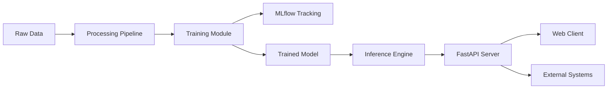

<Note>
  **Status**: Production-Ready | **Technology**: PyTorch, FastAPI, MLflow | **Industry**: Financial Services
</Note>

The **Credit Score AI Engine** is a comprehensive machine learning solution for predicting credit risk using a Deep Neural Network built with PyTorch. This project demonstrates enterprise-grade MLOps and DevOps practices, showcasing the complete lifecycle from data processing to production deployment.

## Project Overview

This is more than a predictive model—it's a reference implementation for AI Engineering that bridges the gap between data science experimentation and production software. The system evaluates creditworthiness in real-time, providing probability scores and binary predictions for financial decision-making.

<CardGroup cols={2}>
  <Card title="Watch: Project Demo" icon="youtube" href="https://youtu.be/S5j4cSOEyik">
    Detailed explanation and live demonstration of the Credit Score AI Engine
  </Card>
  
  <Card title="Watch: Deployment Guide" icon="youtube" href="https://youtu.be/V2LokJd68bU">
    Step-by-step production deployment with Docker and best practices
  </Card>
</CardGroup>

## Architecture & Components

The project follows a modular architecture with clear separation of concerns:



### Core Modules

<Accordion title="Processing Pipeline (processing/)">
  **Location**: `processing/preprocessor.py`
  
  Handles data cleaning and transformation:
  - Feature engineering and encoding
  - Missing value imputation
  - Normalization and scaling
  - Train/test splitting
  
  Ensures data quality before model training, following the "garbage in, garbage out" principle.
</Accordion>

<Accordion title="Model Architecture (model/)">
  **Location**: `model/model.py`
  
  PyTorch-based deep neural network with:
  - Configurable hidden layers and activation functions
  - Batch normalization for training stability
  - Dropout regularization to prevent overfitting
  - Smart weight initialization (He/Xavier)
  
  ```python
  class CreditScoreModel(nn.Module):
      def __init__(self, config: ModelConfig):
          # Dynamic architecture based on configuration
          # Supports: ReLU, LeakyReLU, GELU, Sigmoid, Tanh
          # Includes BatchNorm and Dropout layers
  ```
  
  Key features in `model/model.py:58-151`:
  - `forward()`: Standard forward pass
  - `predict_probability()`: Returns probability scores
  - `binary_prediction()`: Threshold-based classification
</Accordion>

<Accordion title="Training Pipeline (training/)">
  **Location**: `training/training.py`
  
  Manages the complete training workflow:
  - YAML-based configuration management
  - MLflow experiment tracking
  - Model checkpointing
  - Metrics logging (loss, accuracy)
  
  Configuration files in `config/models-configs/` allow experimentation without code changes:
  
  ```yaml
  hyperparameters:
    learning_rate: 0.001
    batch_size: 64
    epochs: 20
    hidden_layers: [128, 64, 32]
    activation_functions: ["relu", "relu", "relu"]
  ```
</Accordion>

<Accordion title="Inference Engine (inference/)">
  **Location**: `inference/inference.py`
  
  Production-ready inference module:
  - Singleton pattern for efficient model loading
  - Automatic preprocessing pipeline
  - Probability and class predictions
  - Error handling and logging
  
  Loads the trained model once and serves predictions efficiently.
</Accordion>

<Accordion title="API Server (server/)">
  **Location**: `server/api.py` and `server/schemas.py`
  
  FastAPI-based REST API with:
  - Automatic OpenAPI documentation
  - Pydantic validation schemas
  - CORS middleware for cross-origin requests
  - Comprehensive error handling
  
  The API schema in `server/schemas.py:51-96` defines strict input validation:
  
  ```python
  class CreditRiskInput(BaseModel):
      Age: int = Field(..., gt=0)
      Sex: SexEnum
      Job: JobEnum
      Housing: HousingEnum
      Saving_accounts: SavingAccountsEnum
      Checking_account: CheckingAccountEnum
      Credit_amount: float = Field(..., gt=0)
      Duration: int = Field(..., gt=0)
      Purpose: PurposeEnum
  ```
  
  Enumerated types ensure only valid values are accepted, preventing data quality issues.
</Accordion>

<Accordion title="Web Client (examples/client_web/)">
  Interactive web interface for testing and demonstration:
  - User-friendly form for input data
  - Real-time predictions
  - Visualization of results
  - Serves as a Backend-for-Frontend (BFF) pattern example
</Accordion>

## Technical Implementation

### Data Schema

The model accepts customer profile data with the following structure:

| Field | Type | Description | Constraints |
|-------|------|-------------|-------------|
| Age | Integer | Customer age in years | Must be > 0 |
| Sex | Enum | Gender | "male" or "female" |
| Job | Enum | Skill level | "unskilled and non-resident", "unskilled and resident", "skilled", "highly skilled" |
| Housing | Enum | Housing type | "own", "rent", "free" |
| Saving accounts | Enum | Savings account status | "NA", "little", "moderate", "quite rich", "rich" |
| Checking account | Enum | Checking account status | "NA", "little", "moderate", "rich" |
| Credit amount | Float | Requested credit amount | Must be > 0 |
| Duration | Integer | Credit duration in months | Must be > 0 |
| Purpose | Enum | Credit purpose | "car", "furniture/equipment", "radio/TV", "domestic appliances", "repairs", "education", "business", "vacation/others" |

### Model Configuration

The neural network architecture is fully configurable via `ModelConfig` dataclass in `model/model.py:19-34`:

```python
@dataclass
class ModelConfig:
    input_size: int
    hidden_layers: list[int]
    activation_functions: list[str]
    output_size: int = 1
    dropout_rate: float = 0.2
    learning_rate: float = 0.001
    epochs: int = 100
    batch_size: int = 32
    checkpoint_path: str = "./model/checkpoint"
```

### Supported Activation Functions

The model supports multiple activation functions (see `model/model.py:37-54`):

- **ReLU**: Standard rectified linear unit
- **Leaky ReLU**: Prevents dead neurons with small negative slope
- **GELU**: Gaussian Error Linear Unit (used in transformers)
- **Sigmoid**: S-shaped curve for probability outputs
- **Tanh**: Hyperbolic tangent
- **Softmax**: Multi-class probability distribution

## Getting Started

<Steps>
  <Step title="Environment Setup">
    Install dependencies using UV (modern Python package manager):
    
    ```bash
    uv sync
    ```
    
    Or using traditional pip:
    
    ```bash
    pip install -r requirements.txt
    ```
  </Step>
  
  <Step title="Start MLflow Tracking">
    Launch the MLflow UI to monitor experiments:
    
    ```bash
    uv run mlflow ui
    ```
    
    Access the dashboard at `http://127.0.0.1:5000`
  </Step>
  
  <Step title="Train the Model">
    Execute training with a configuration file:
    
    ```bash
    uv run training/training.py --config config/models-configs/model_config_001.yaml
    ```
    
    The trained model and metrics are automatically logged to MLflow.
  </Step>
  
  <Step title="Launch API Server">
    Start the FastAPI backend:
    
    ```bash
    uv run uvicorn server.api:app --reload --port 8000
    ```
    
    API documentation available at `http://localhost:8000/docs`
  </Step>
  
  <Step title="Launch Web Client">
    Start the demonstration interface:
    
    ```bash
    uv run uvicorn examples.client_web.main:app --reload --port 3000
    ```
    
    Access the web app at `http://localhost:3000`
  </Step>
</Steps>

## Docker Deployment

For production deployment using containers:

```bash
docker-compose up --build
```

This orchestrates:
- API Server (Port 8000)
- Web Client (Port 3000)

<Note>
Docker ensures "works on my machine" means "works in production" through consistent, isolated environments.
</Note>

## API Endpoints

### POST /credit_score_prediction

Predicts credit risk based on customer data.

**Request Body Example**:

```json
{
  "Age": 35,
  "Sex": "male",
  "Job": "unskilled and resident",
  "Housing": "free",
  "Saving accounts": "NA",
  "Checking account": "NA",
  "Credit amount": 9055,
  "Duration": 36,
  "Purpose": "education"
}
```

**Response**:

```json
{
  "prediction": "good",
  "probability": 0.8523
}
```

- `prediction`: Binary classification ("good" or "bad")
- `probability`: Confidence score for "good" classification (0-1)

## Real-World Applications

This credit scoring engine can be deployed across multiple financial verticals:

<CardGroup cols={2}>
  <Card title="Neobanks & Fintechs" icon="building-columns">
    Real-time decision engines for credit card approvals in milliseconds, drastically reducing Customer Acquisition Cost (CAC)
  </Card>
  
  <Card title="E-commerce BNPL" icon="cart-shopping">
    Native payment gateway integration for instant "Buy Now, Pay Later" financing based on user behavior
  </Card>
  
  <Card title="Property Technology" icon="house">
    Real-time tenant risk evaluation for rental contracts and default insurance
  </Card>
  
  <Card title="Telecommunications" icon="tower-cell">
    Dynamic postpaid plan approvals and premium device financing based on payment probability
  </Card>
  
  <Card title="Microfinance" icon="hand-holding-dollar">
    Alternative scoring models for unbanked populations using demographic and non-traditional transactional data
  </Card>
  
  <Card title="Insurance Technology" icon="shield-halved">
    Dynamic premium adjustment based on financial risk profile correlation
  </Card>
</CardGroup>

## MLOps Best Practices

This project exemplifies production-grade ML engineering:

### Experiment Tracking

- **MLflow Integration**: All training runs logged with parameters, metrics, and model artifacts
- **Version Control**: Models versioned and tagged for production deployment
- **Reproducibility**: Exact experiment replication using logged configurations

### Configuration Management

- **YAML-based configs**: Hyperparameter tuning without code changes
- **Environment isolation**: UV lock files ensure deterministic dependencies
- **Model checkpointing**: Automatic saving of best-performing models

### Code Quality

- **Type hints**: Full type annotations for better IDE support and error detection
- **Logging**: Comprehensive logging at all application layers
- **Error handling**: Graceful degradation and informative error messages
- **Schema validation**: Pydantic ensures data quality at API boundaries

### Deployment

- **Containerization**: Docker images for consistent environments
- **Orchestration**: Docker Compose for multi-service coordination
- **Scalability**: Stateless API design allows horizontal scaling
- **Monitoring**: Structured logs for observability

## Technology Stack

| Component | Technology | Purpose |
|-----------|------------|----------|
| Deep Learning | PyTorch | Neural network implementation |
| API Framework | FastAPI | High-performance REST API |
| Validation | Pydantic | Runtime data validation |
| Experiment Tracking | MLflow | Model versioning and metrics |
| Package Management | UV | Fast, deterministic dependency resolution |
| Containerization | Docker | Environment isolation |
| Orchestration | Docker Compose | Multi-service deployment |
| Data Versioning | DVC | Dataset version control |

## Project Structure

```text
credit-score/
├── config/
│   ├── logs_configs/          # Logging configuration
│   └── models-configs/        # Model hyperparameters (YAML)
├── examples/
│   └── client_web/            # Web interface demo
├── inference/
│   └── inference.py           # Prediction engine
├── model/
│   └── model.py               # PyTorch neural network
├── processing/
│   └── preprocessor.py        # Data transformation pipeline
├── server/
│   ├── api.py                 # FastAPI endpoints
│   └── schemas.py             # Pydantic schemas
├── training/
│   └── training.py            # Training orchestration
├── docker-compose.yml         # Service orchestration
├── Dockerfile.api             # API container definition
├── Dockerfile.client          # Client container definition
└── pyproject.toml             # Project metadata
```

## Key Takeaways

<Note>
**Why This Project Matters**:

This isn't just a machine learning model—it's a complete AI Engineering solution demonstrating:

1. **Production-Ready Architecture**: Modular design with clear separation of concerns
2. **DevOps Integration**: CI/CD-friendly with containerization and configuration management
3. **MLOps Maturity**: Experiment tracking, model versioning, and reproducibility
4. **Enterprise Patterns**: API-first design, validation layers, and error handling
5. **Scalability**: Stateless design allows horizontal scaling for high-traffic scenarios
</Note>

## Next Steps

Explore the implementation:

- Review the model architecture in `python-projects/credit-score/model/model.py`
- Examine API schemas in `python-projects/credit-score/server/schemas.py`
- Study the training pipeline in `python-projects/credit-score/training/training.py`
- Test the API using the interactive Swagger UI
- Experiment with different model configurations

<Card title="View Source Code" icon="github" href="https://github.com">
  Access the complete source code repository
</Card>
